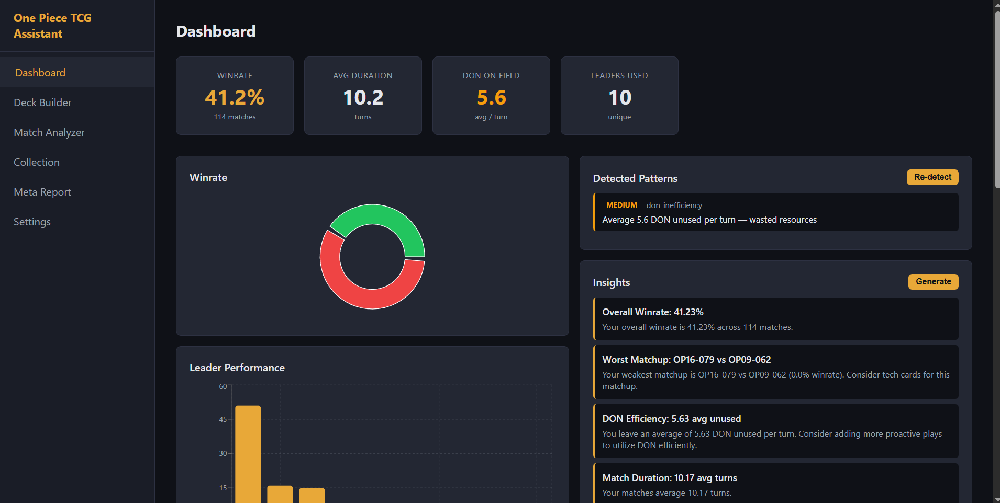
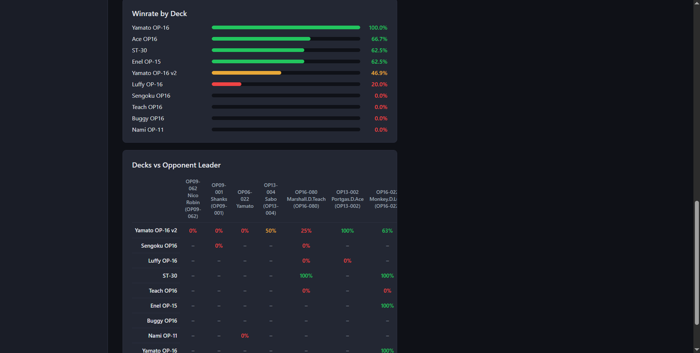
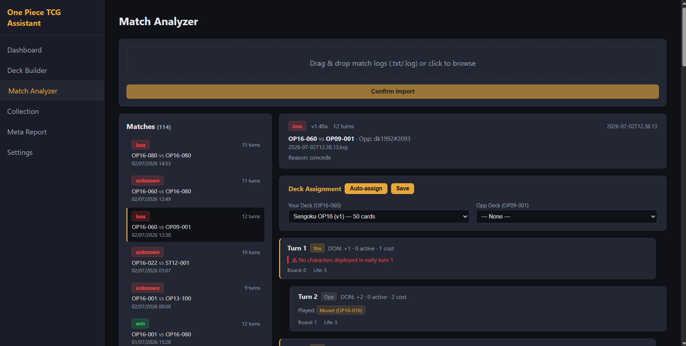
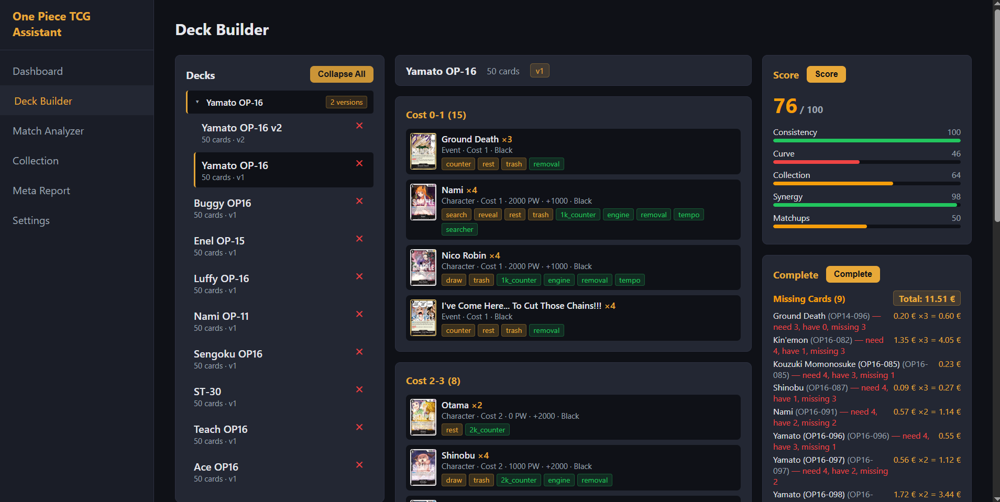
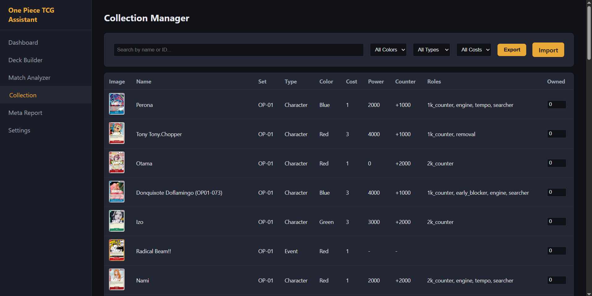
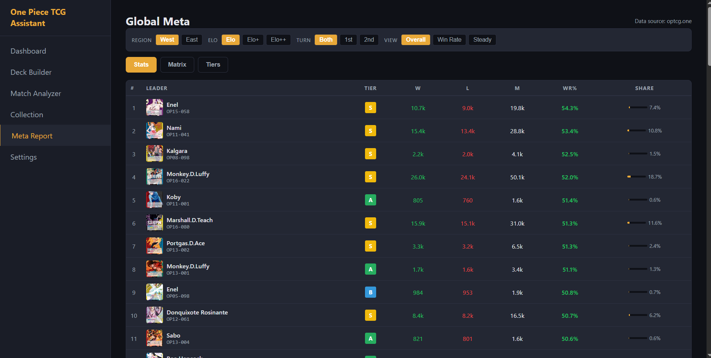
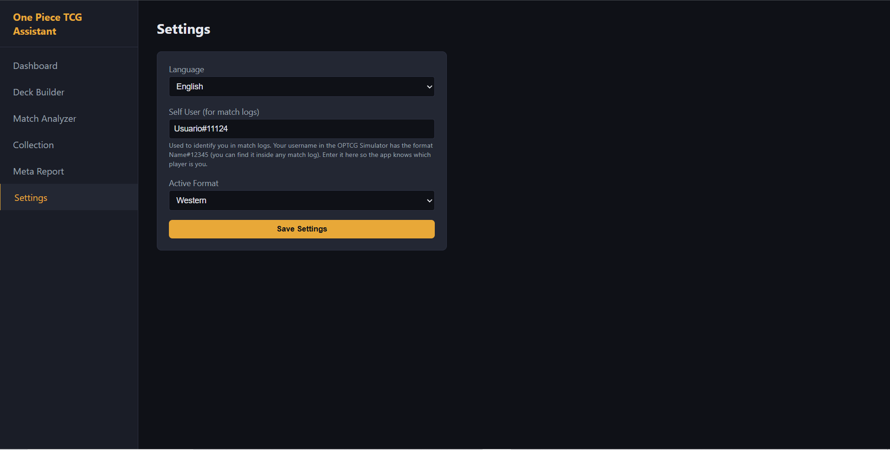

# One Piece TCG Assistant

[](LICENSE)

A companion app for the **One Piece Trading Card Game** that helps you analyze
your matches, build and evaluate decks, track your collection, and get
statistical insights — all from your own computer.

> **You don't need any programming experience to use this app.**
> If you can install a program and follow step-by-step instructions, you can
> run it.

---

## Table of Contents

- [What Does This App Do?](#what-does-this-app-do)
- [Screenshots](#screenshots)
- [Where to Find Your Match Logs](#where-to-find-your-match-logs)
- [Installation — Easy Route (Docker)](#installation--easy-route-docker)
  - [Step 1: Install Docker](#step-1-install-docker)
  - [Step 2: Start the App](#step-2-start-the-app)
- [Installation — Advanced Route (Manual)](#installation--advanced-route-manual)
- [How to Use the App](#how-to-use-the-app)
- [Updating to a New Version](#updating-to-a-new-version)
- [Troubleshooting](#troubleshooting)
- [For Developers](#for-developers)
- [License](#license)

---

## What Does This App Do?

If you play One Piece TCG on the [OPTCG Simulator](https://simulator.optcg.com/),
this app turns your game data into insights:

| Feature | What it means |
|---|---|
| **Match Analyzer** | Upload your match logs and see a turn-by-turn breakdown: what was played, attacks, counters, DON usage, and who won. |
| **Deck Builder** | Paste a deck list (e.g. from the simulator), and the app checks if it's legal, scores it, and suggests missing cards. You can also create multiple versions of a deck under the same leader. |
| **Dashboard** | See your overall win rate, best leaders, most-played cards, and patterns in your play (e.g. "you lose too often when falling behind early"). |
| **Collection Manager** | Import your card collection from a CSV file (Collectr format) and see what you own. |
| **Meta Report** | See which leaders and decks are popular, their win rates, and how matchups compare. |

The app runs **100% locally** on your computer. Your data never leaves your
machine.

---

## Screenshots

> **Placeholder** — Replace the files in `docs/screenshots/` with actual
> screenshots of your app.

| Dashboard | Dashboard (cont.) | Match Analyzer |
|---|---|---|
|  |  |  |

| Deck Builder | Collection Manager | Meta Report |
|---|---|---|
|  |  |  |

| Settings | | |
|---|---|---|
|  | | |

---

## Where to Find Your Match Logs

The OPTCG Simulator automatically saves a log file after each game. These logs
are typically found inside the simulator's installation folder, under:

```
CombatLogs/AutoSaved/
```

The exact location depends on where you installed the simulator. You'll see
files ending in `.log` — these are what the app reads. You don't need to copy
them anywhere; the app lets you import them directly via drag & drop (see
[How to Use the App](#how-to-use-the-app)).

---

## Installation — Easy Route (Docker)

This is the recommended method. Docker is a tool that packages everything the
app needs into one container, so you don't have to install Python, Node.js, or
anything else manually.

### Step 1: Install Docker

**Windows:**

1. Go to <https://www.docker.com/products/docker-desktop/>
2. Download **Docker Desktop for Windows**
3. Run the installer and follow the prompts
4. Restart your computer if asked
5. Open **Docker Desktop** — wait until you see the whale icon in your taskbar
   turn steady (not animated). This means Docker is ready.

> **Windows users:** If Docker asks you to enable **WSL 2**, say yes. It's a
> normal part of setup. After installation, Docker Desktop should say
> "Engine running" in the bottom-left corner.

**macOS:**

1. Go to <https://www.docker.com/products/docker-desktop/>
2. Download **Docker Desktop for Mac** (choose Apple Silicon or Intel depending
   on your Mac)
3. Drag Docker to your Applications folder
4. Open Docker from Launchpad and wait for it to start

**Linux:**

```bash
curl -fsSL https://get.docker.com | sh
sudo usermod -aG docker $USER
# Log out and back in for the group change to take effect
```

### Step 2: Start the App

Open a **terminal** in the project folder:

- **Windows:** Open the project folder in File Explorer, then type `cmd` in the
  address bar at the top and press Enter
- **macOS:** Open Terminal, then `cd` into the project folder

Run these commands:

```bash
docker compose -f deploy/docker-compose.yml up -d --build
```

Wait (the first time it builds everything from scratch). When
it's done, open your browser and go to:

> **http://localhost:8000**

You should see the app's dashboard. That's it — the app is running!

The card database downloads automatically the first time you start the app,
and is kept up to date with incremental updates every week. You don't need to
do anything manual.

**Before importing matches:** Go to **Settings** and set your simulator
username so the app can identify which player is you in each match log. See
[How to Use the App](#how-to-use-the-app) for details.

**To stop the app later:**

```bash
docker compose -f deploy/docker-compose.yml down
```

**To start it again:**

```bash
docker compose -f deploy/docker-compose.yml up -d
```

(No `--build` needed after the first time.)

---

## Installation — Advanced Route (Manual)

If you don't want to use Docker, you can run the app directly. You'll need:

- **Python 3.11+** — <https://www.python.org/downloads/>
- **Node.js 18+** — <https://nodejs.org/>

#### 1. Set up and start the backend

```bash
cd backend
python -m venv .venv

# Windows (PowerShell)
.venv\Scripts\Activate.ps1

# macOS / Linux
source .venv/bin/activate

pip install -e ".[dev]"
alembic upgrade head
```

Start the backend server:

```bash
uvicorn app.presentation.main:app --reload --port 8000
```

The card database will download automatically on first startup.

#### 2. Set up and start the frontend

Open a **new terminal** (leave the backend running):

```bash
cd frontend
npm install
npm run build
```

The app is now served by the backend at <http://localhost:8000>.

#### 3. Configure your settings

Open the app in your browser and go to **Settings** to:
- Set your simulator username (required before importing matches)
- Choose your preferred language
- Select the active format (Western/Eastern/etc.)

---

## How to Use the App

Once the app is running at `http://localhost:8000`, here's how to get started:

### Configure Your Username (required first)

Before you can import match logs, you need to tell the app your OPTCG
Simulator username. This is how the app knows which player is you in each
match.

Your username in the simulator has the format **`Name#12345`** (a name
followed by `#` and a number). You can find it inside any match log file:
open a `.log` file in a text editor and look for `[YourName#12345]` at the
start of lines.

1. Go to **Settings**
2. Enter your username in the **Self User** field (e.g. `YourName#12345`)
3. Click **Save Settings**

> Until this is configured, the Match Analyzer will not let you import matches.

### Import Your Match Logs

1. Click **Match Analyzer** in the sidebar
2. Drag and drop your `.log` files onto the upload area, or click it to browse
   and select files
   - You can select **multiple files at once** (hold Ctrl/Cmd to pick several)
3. The selected files appear in a list
4. Click **Confirm Import** to process them
5. Once imported, click any match in the list to see the turn-by-turn breakdown

### Build a Deck

1. Go to **Deck Builder**
2. Click **Import Deck**
3. Paste your deck text (from the simulator export, format: `4xOP16-001`)
4. Give it a name and click **Import**
5. Use the **Validate**, **Score**, and **Complete** buttons to analyze it

**Deck versions:** If you have multiple variants of a deck with the same leader,
use the **New Version** option when importing. Versions are grouped together
under the same leader and numbered automatically (v1, v2, v3…). This lets you
compare different builds side by side and assign the correct version to each
match.

### View Your Stats

The **Dashboard** shows your win rate, leader performance, most-played cards,
and detected patterns — all based on the matches you've imported.

### Import Your Collection

1. Export your collection as a CSV from [Collectr](https://www.collectr.com)
2. Go to the **Collection** page and upload the CSV file

The CSV must have the following columns (Collectr's default export format):

```csv
Portfolio Name,Category,Set,Product Name,Card Number,Rarity,...,Quantity,...
Main,One Piece,500 Years in the Future,Blaze Slice,OP07-116,R,...,1,...
Main,One Piece,500 Years in the Future,Caribou,OP07-023,UC,...,1,...
```

The app reads the **Category**, **Card Number**, **Product Name**, and
**Quantity** columns. Only rows with `Category = "One Piece"` are imported
(other TCGs and Japanese cards are skipped automatically).

### Change Language or Settings

Go to **Settings** to switch between Spanish and English, set your simulator
username, and choose the active format (Western/Eastern/etc.).

---

## Updating to a New Version

**With Docker:**

```bash
# Pull the latest code, then rebuild:
docker compose -f deploy/docker-compose.yml down
docker compose -f deploy/docker-compose.yml up -d --build
```

**Manual:** Re-run `git pull`, then repeat the setup steps for backend and
frontend.

Your data (matches, decks, collection) is preserved across updates — it's
stored separately from the app code.

---

## Troubleshooting

| Problem | Solution |
|---|---|
| **"Connection refused" or page won't load** | Make sure Docker is running (check the Docker Desktop icon). Make sure the container is up (`docker compose -f deploy/docker-compose.yml ps`). |
| **Docker build fails** | Make sure you're in the project root folder (the one containing `deploy/`). Try `docker compose -f deploy/docker-compose.yml build --no-cache`. |
| **Can't import matches** | You must configure your simulator username in **Settings** first. The app needs it to identify which player is you. |
| **Match import fails** | Make sure the files are `.log` or `.txt` files from the OPTCG Simulator. Corrupted or incomplete logs may be rejected. |
| **Port 8000 already in use** | Another program is using port 8000. Edit `deploy/docker-compose.yml` and change `"8000:8000"` to `"8001:8000"`, then access the app at `http://localhost:8001`. |
| **Docker says "WSL 2" error (Windows)** | Install WSL 2: open PowerShell as admin and run `wsl --install`, then restart. |

---

## For Developers

See [CONTRIBUTING.md](CONTRIBUTING.md) for development setup, architecture,
code style, and testing.

### Tech Stack

| Component | Technology |
|---|---|
| Backend | Python 3.11+, FastAPI, SQLAlchemy, Alembic |
| Frontend | React, Vite, TypeScript |
| Database | SQLite |
| Vector Store | ChromaDB (embedded) |
| Embeddings | sentence-transformers all-MiniLM-L6-v2 |
| Jobs | APScheduler |
| Deploy | Docker |

### Architecture

Clean Architecture: **domain** (pure logic) → **application** (use cases) →
**infrastructure** (I/O) → **presentation** (FastAPI).

The domain layer has zero framework dependencies.

### Quick Commands

```bash
# Backend
cd backend && pip install -e ".[dev]"   # Install
cd backend && ruff check                 # Lint
cd backend && pytest -v                  # Test
cd backend && uvicorn app.presentation.main:app --reload --port 8000  # Run

# Frontend
cd frontend && npm install               # Install
cd frontend && npm run lint              # Lint
cd frontend && npm run build             # Build
```

### Importing Match Logs (API)

```bash
# Single log
curl -X POST http://localhost:8000/api/matches/import \
  -F "file=@my-match.log"

# Multiple logs (batch)
curl -X POST http://localhost:8000/api/matches/import-batch \
  -F "files=@match1.log" \
  -F "files=@match2.log"
```

---

## License

[MIT](LICENSE)
